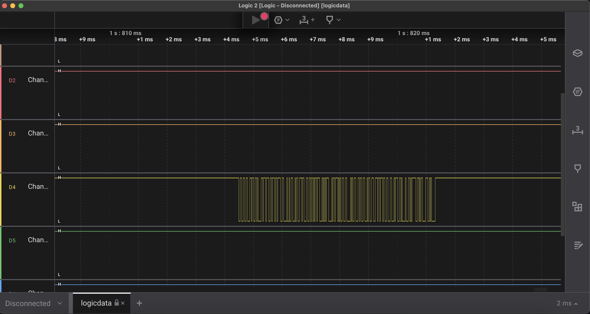
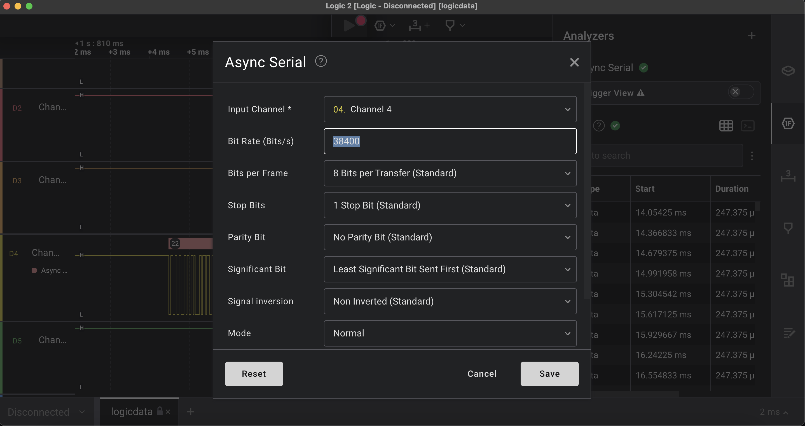
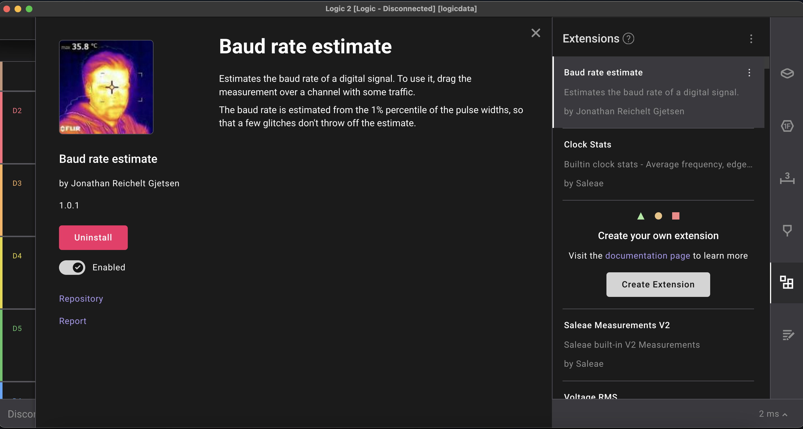
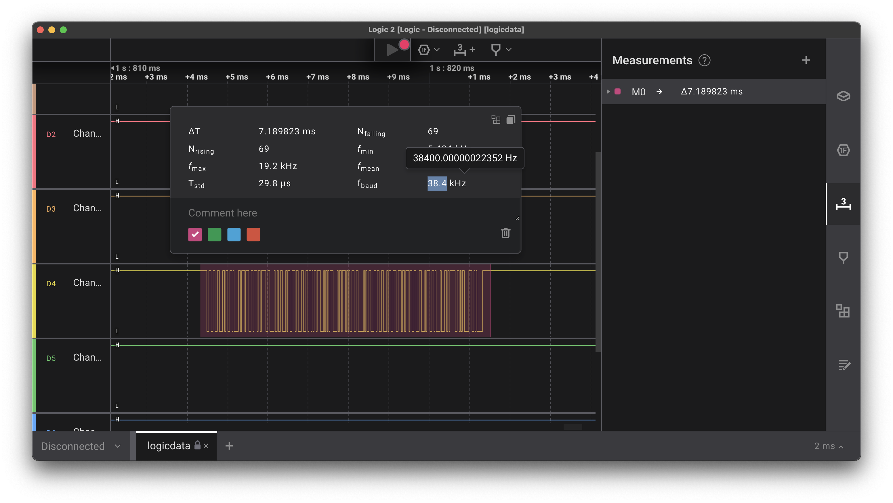
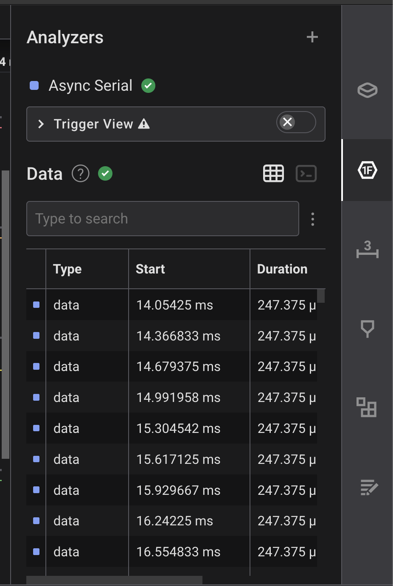
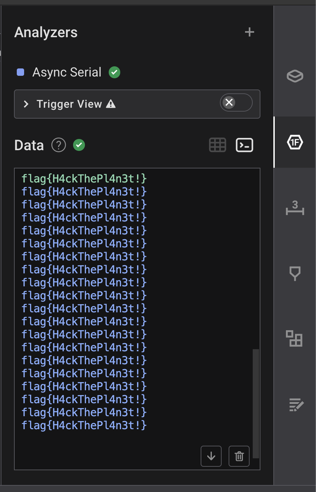

# L0g1c_sn1ff

## Description

Our spy has captured a digital signal from an unknown device using a saleae logic analyzer. Your mission, should you choose to accept it, is to decode the signal and unveil the secret message embedded within. Good luck, and may your decoding skills be sharp and swift. Flag Format: flag{printable_ascii}

## Solution

1. The challenge description tells us that the data was captured using saleae logic analyzer. We can download it from https://www.saleae.com/
2. Then just drag and drop the challenge file i.e. logicdata.sal into the downloaded app.
3. We can see that only a single channel has signals (Ch4).

4. We can click on Analyzers from the right sidebar and select Async serial. 

5. To make this work properly, we need to know the baudrate of the signal. This can be found manually and using a simple Extension inside the Saleae logic analyzer called *Baud rate estimate*

6. Once the extension is installed,, we can simply goto the measurements section and use the "+" icon to select a region.
7. After selection you will be shown some information related to the signal which inclues the baud rate.

8. Simply use this baud rate with the analyzer Async serial and voilaa! You can see the data on the right side.

9. Click on the terminal icon to see the data in printable_ascii.

## Flag

flag{H4ckTheP14n3t!}