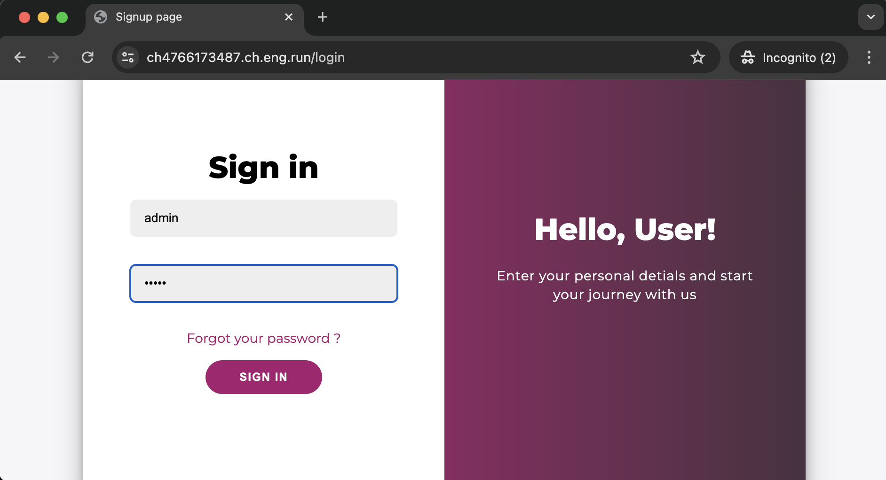
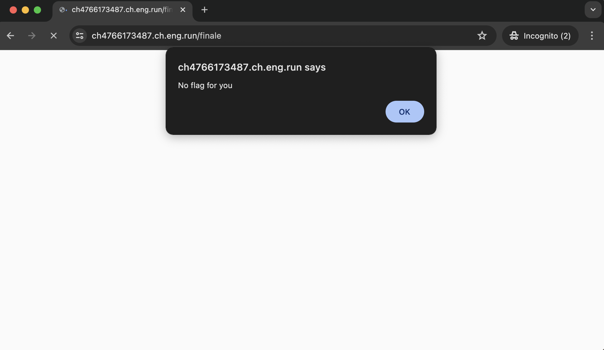
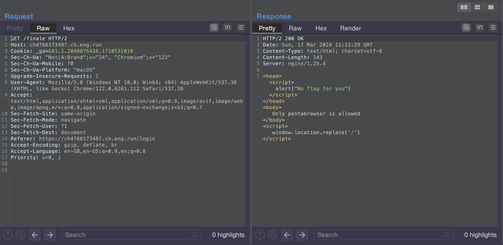
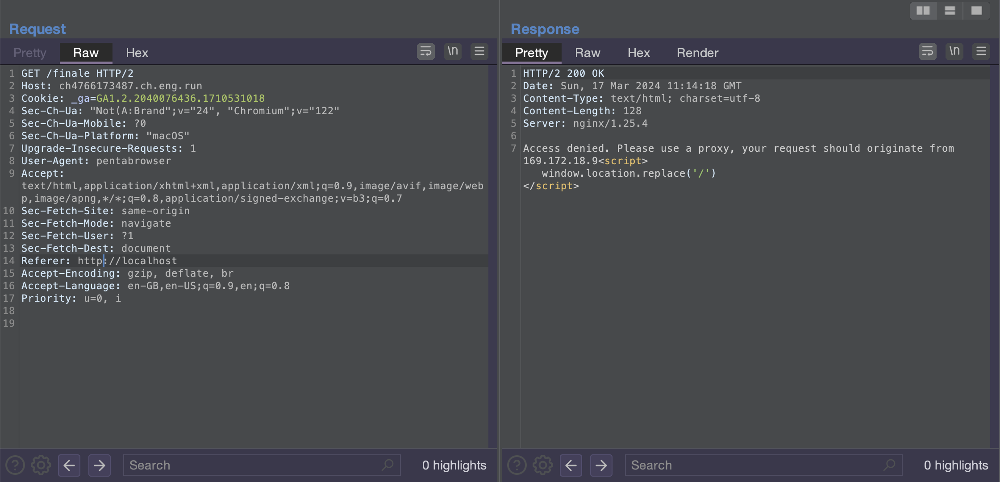
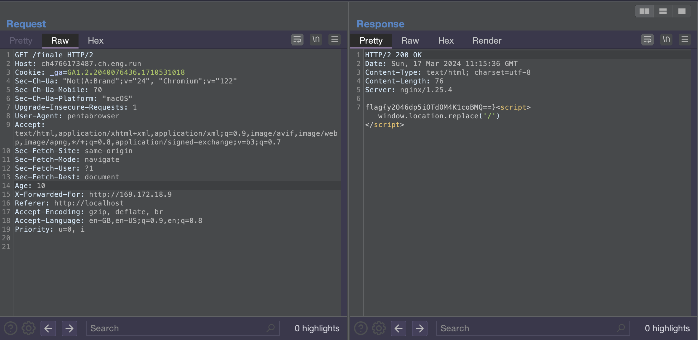
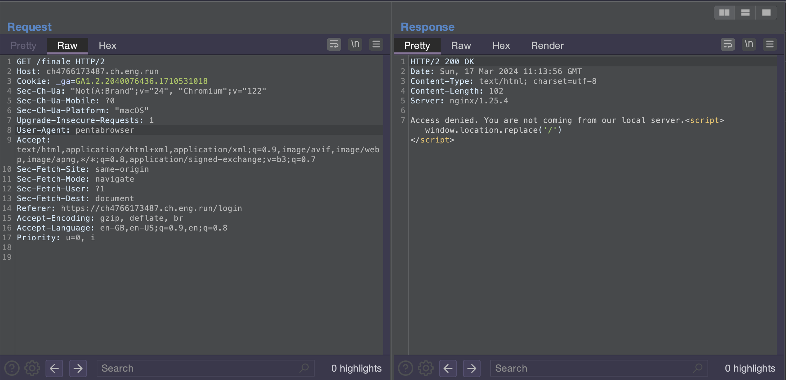
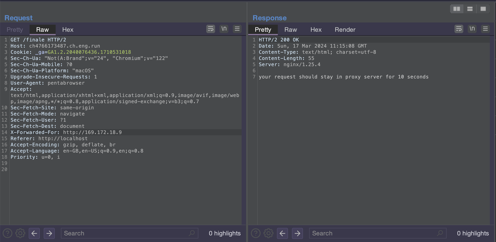

# Health care

## Description

You finally come across a unique health care application. Everyone has tried their best to get info from it, but no one has been able to get anything useful. It allways makes silly excuses. Can you help us?

## Solution

1. After launching and opening the instance, we can see a login button which redirects to a login page
2. We are able to login using default admin creds i.e. admin:admin



3. We can see a flag option in the sidebar which when clicked alerts "No Flag For You!"



4. To see the full response we can load the request in BurpSuite



5. We can see a error which says, "Only pentabrowser is allowed". But no browser with that name exists....

Servers  usually identify the browser using the "User-Agent" header. Therefore setting it to pentabrowser i.e ```User-Agent: pentabrowser``` takes us to the next step.



6. In this step we get a error, "Access denied. You are not coming from our local server."

Again, how it checks that from where are we coming? Using the Referer header. Setting the Refer header to localhost i.e ```Referer: http://localhost``` takes us to the next step.



7. New step introduces new error, i.e. "Access denied. Please use a proxy, your request should originate from
169.172.18.9".

By now you must have guessed that we need another header, but which one? The answer is X-Forwarded-For which should be set to the IP. i.e. ```X-Forwarded-For: http://169.172.18.9```



8. Similarly for the "your request should stay
in proxy server for 10
second" error, we can use the Age header set to the required time. i.e ```Age: 10``` and Bingo!!! We get the flag!!.



## Flag

flag{y2046dp5i0Td0M4K1coBMQ==}