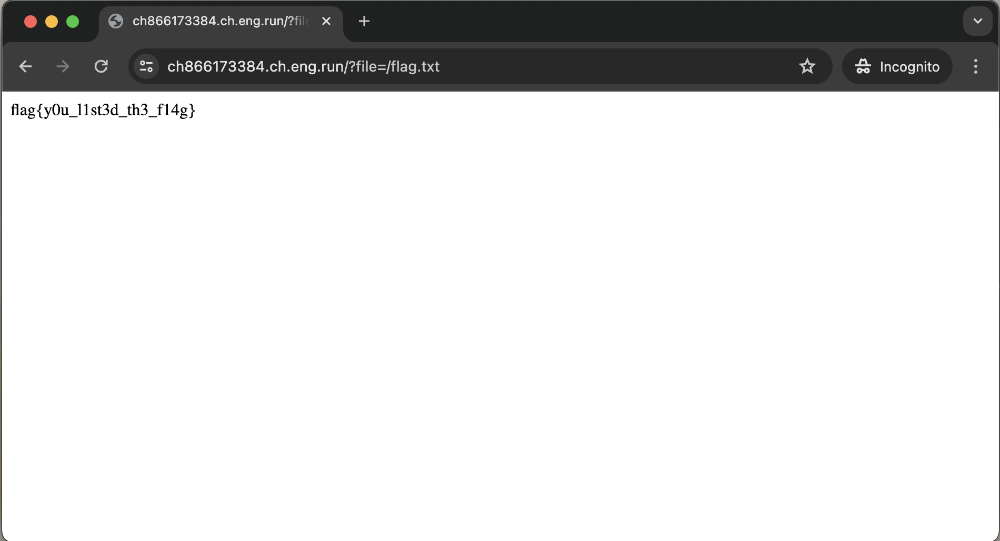

# Local Bank

## Description

Your uncle has launched a new bank and wants you to test its website for any vulnerabilities. He's hidden a file with sensitive information somewhere on the site. Your task is to find it. Can you uncover the secret and ensure the website's security?

## Solution

1. After launching and opening the instance, we can see the URL: https://<id>.ch.eng.run/?file=index.html
2. Looking at the "__file__" parameter, the first thing I think of is LFI (Local File Inclusion)
3. By Changing the file parameter to /flag.txt we can get the flag. (The flag is usually present at the root)

## Screenshots

## Flag

flag{yOu_11st3d_th3_f14g}